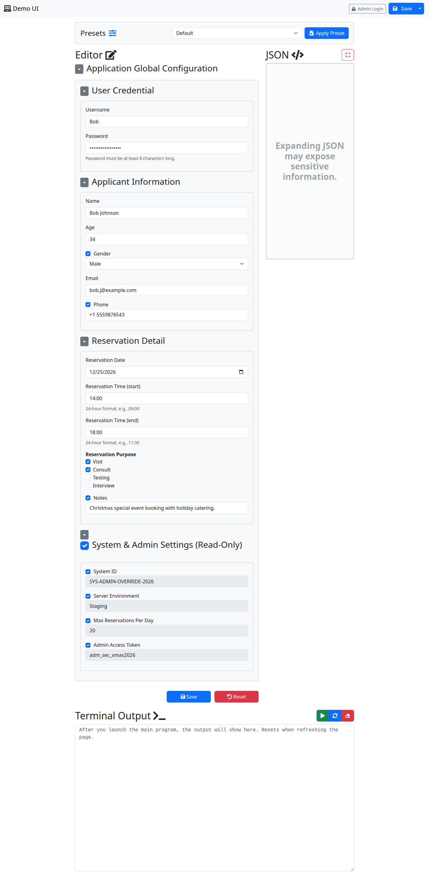
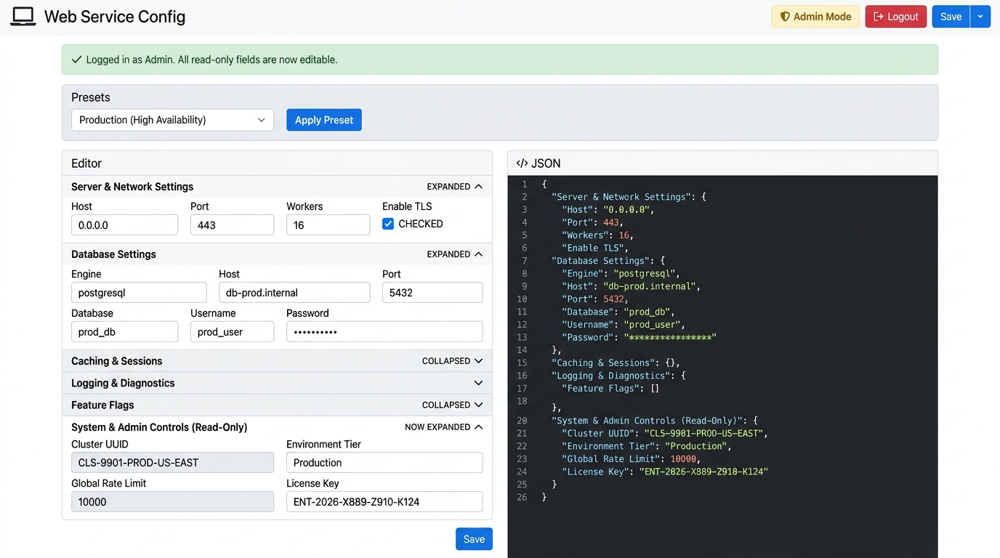

# pyConfigWebUI

[](LICENSE)
[](https://github.com/lucienshawls/py-config-web-ui/releases/latest)
[](https://pypi.org/project/configwebui-lucien/)
[](https://pypi.org/project/configwebui-lucien/)

A modern, lightweight, web-based configuration editor for Python applications.

**pyConfigWebUI** turns standard JSON Schemas and configuration files into an interactive, user-friendly web interface with preset configuration switching, real-time schema validation, side-by-side JSON preview, and role-based Admin Mode for unlocking restricted variables.

---

## 🌟 Key Features

- 🔒 **100% Offline by Design**: All CSS (Bootstrap 5), JavaScript (JSONEditor, jQuery Slim), icons (FontAwesome), and web fonts are bundled directly in the package. **Zero internet connection or external CDN required.** Ideal for air-gapped environments, devcontainers, HPC clusters, and local deployments.
- 🎛️ **Configuration Presets**: Easily register and switch between named preset configurations (e.g. *Default*, *Development*, *Production*, *High-Performance*) from memory dicts or JSON files in one click.
- 🛡️ **Admin Mode & Read-Only Variable Locking**:
  - Secure critical or system parameters by marking them `"readOnly": true` in your JSON Schema.
  - Guest users view read-only fields as disabled and cannot tamper with them.
  - Authenticate with **Admin Login** to instantly unlock and modify restricted settings.
- 📝 **Side-by-Side Live UI & JSON Preview**: Modern split-view with form controls on the left and synchronized formatted JSON preview on the right.
- 🔍 **Multi-Level Validation**:
  - Real-time client-side input validation based on standard [JSON Schema](https://json-schema.org/).
  - Server-side schema validation with `jsonschema`.
  - Custom cross-field validation rules via `extra_validation_func`.
- 🔌 **Flexible Storage Handlers**: Persist to default JSON files or integrate custom `save_func` / `load_func` (YAML, SQLite, Redis, cloud stores).
- 🚀 **Interactive Task Runner**: Hook a `main_entry` callable to run background tasks with live streamed terminal logs (stdout / stderr) directly in the browser.
- 🛑 **Graceful Lifecycle Management**: Clean server termination from the UI navbar or via terminal interrupt (`Ctrl+C`).

---

## 📦 Installation

### From PyPI
```bash
pip install configwebui-lucien
```

### From Source
```bash
git clone https://github.com/lucienshawls/py-config-web-ui.git
cd py-config-web-ui
pip install -r requirements.txt
```

---

## 🚀 Quick Start (in 30 Seconds)

Create a file `app.py`:

```python
from configwebui import ConfigEditor

schema = {
    "title": "Application Config",
    "type": "object",
    "properties": {
        "server_host": {"title": "Host", "type": "string", "default": "127.0.0.1"},
        "server_port": {"title": "Port", "type": "integer", "default": 8080, "minimum": 1, "maximum": 65535},
        "debug_mode": {"title": "Debug Mode", "type": "boolean", "default": True},
    },
    "required": ["server_host", "server_port"],
}

editor = ConfigEditor(
    app_name="App Config Editor",
    config_file="config.json",
    schema=schema,
)

if __name__ == "__main__":
    editor.run(host="127.0.0.1", port=5000)
```

Run the application:
```bash
python app.py
```
Open `http://127.0.0.1:5000` in your browser.

---

## 📸 Screenshots & Workflow

### 1. Guest View (Read-Only Fields Protected)
Guest users can modify editable fields, but restricted parameters remain locked.


### 2. Admin View (Unlocked Fields)
Logging in with the admin password removes read-only restrictions and permits changes to all settings.


---

## 📚 Feature Guides & Recipes

### 1. Configuration Presets

Presets let users quickly switch between pre-configured parameter profiles:

```python
presets = {
    "Development": {
        "server_host": "127.0.0.1",
        "server_port": 8000,
        "debug_mode": True,
    },
    "Production": "presets/prod.json",  # File path or dict
}

editor = ConfigEditor(
    app_name="Server Manager",
    config_file="config/main.json",
    schema=schema,
    presets=presets,
    default_preset="Development",
)
```

### 2. Admin Mode & Field Locking

To protect sensitive variables (API keys, cluster IDs, infrastructure endpoints), set `"readOnly": true` in the schema definition:

```python
schema = {
    "type": "object",
    "properties": {
        "app_title": {"type": "string", "default": "My App"},
        "system_uuid": {
            "title": "System UUID (Protected)",
            "type": "string",
            "default": "SYS-9812-PROD",
            "readOnly": True,  # Locked for guests, unlocked for Admin
        },
    },
}

editor = ConfigEditor(
    app_name="Secured Config",
    schema=schema,
    admin_password="my-secure-password",  # Admin login password
)
```

### 3. Custom Business Validation

Use `extra_validation_func` to enforce multi-field dependencies and custom domain rules:

```python
from configwebui import ResultStatus

def validate_pipeline_config(config: dict) -> ResultStatus:
    batch_size = config.get("batch_size", 0)
    buffer_size = config.get("buffer_size", 0)

    if buffer_size < batch_size * 2:
        return ResultStatus(
            False,
            f"Buffer size ({buffer_size}) must be at least 2x batch size ({batch_size * 2})!"
        )
    return ResultStatus(True)

editor = ConfigEditor(
    app_name="Pipeline Editor",
    schema=schema,
    extra_validation_func=validate_pipeline_config,
)
```

### 4. Custom Storage (YAML, SQLite, Redis, Database)

Override default JSON file persistence by providing `save_func` and `load_func`:

```python
import yaml
from configwebui import ResultStatus

def load_yaml_config() -> dict:
    with open("config.yaml", "r") as f:
        return yaml.safe_load(f) or {}

def save_yaml_config(config: dict) -> ResultStatus:
    with open("config.yaml", "w") as f:
        yaml.safe_dump(config, f, sort_keys=False)
    return ResultStatus(True, "Saved to YAML successfully.")

editor = ConfigEditor(
    app_name="YAML Config Editor",
    schema=schema,
    load_func=load_yaml_config,
    save_func=save_yaml_config,
)
```

### 5. Running Main Program & Streaming Logs

Hook your main application entry point to execute directly from the web interface:

```python
import time
from configwebui import ResultStatus

def run_backup_task():
    print("Starting database backup...")
    for i in range(1, 4):
        time.sleep(1)
        print(f"Backing up partition {i}/3...")
    print("Backup completed successfully!")
    return ResultStatus(True)

editor = ConfigEditor(
    app_name="Backup Manager",
    config_file="backup_config.json",
    schema=schema,
    main_entry=run_backup_task,
)
```

---

## 📂 Example Project Folders & Demos

Each example is organized as its own self-contained **project folder** with dedicated `schema/` (unified JSON schema), `config/` (active config and complete preset files), and `app.py` runner:

```
examples/
├── web_service/               # Enterprise Web Service Config Project
│   ├── app.py                 # UI Runner with Presets & Admin Security
│   ├── schema/schema.json     # Unified schema (server, db, cache, logging, security)
│   └── config/
│       ├── config.json        # Active configuration file
│       └── presets/           # Presets (development, staging, production, testing_ci)
│
├── data_pipeline/             # Ingestion & ETL Data Pipeline Project
│   ├── app.py                 # UI Runner with Custom Cross-Field Business Validation
│   ├── schema/schema.json     # Unified ETL schema (sources, batches, compression, KMS)
│   └── config/
│       ├── config.json        # Active configuration file
│       └── presets/           # Presets (batch_etl, realtime_streaming, memory_optimized)
│
└── model_training/            # ML Training & Hyperparameter Tuning Project
    ├── app.py                 # UI Runner with Background Task Execution
    ├── trainer.py             # Background training worker streaming stdout logs
    ├── schema/schema.json     # Unified ML schema (architecture, epochs, optimizer, GPU)
    └── config/
        ├── config.json        # Active configuration file
        └── presets/           # Presets (quick_experiment, standard_training, high_accuracy_gpu)
```

### Running the Projects

1. **Enterprise Web Service** (Presets & Admin Mode):
   ```bash
   python examples/web_service/app.py
   ```
2. **Data Pipeline** (Custom Business Validation):
   ```bash
   python examples/data_pipeline/app.py
   ```
3. **ML Model Training** (Task Execution & Live Terminal Logs):
   ```bash
   python examples/model_training/app.py
   ```
4. **Interactive Reservation System Demo**:
   ```bash
   python demo/demo_ui.py
   ```

---

## 🛠️ Complete API Reference

### `ConfigEditor`

```python
ConfigEditor(
    app_name: str = "Config Editor",
    config_file: str | None = None,
    schema: dict | str | None = None,
    config: dict | None = None,
    presets: dict[str, dict | str] | None = None,
    default_preset: str | None = None,
    admin_password: str = "admin",
    extra_validation_func: Callable | None = None,
    save_func: Callable | None = None,
    load_func: Callable | None = None,
    main_entry: Callable | None = None,
)
```

#### Constructor Parameters

| Parameter | Type | Default | Description |
|---|---|---|---|
| `app_name` | `str` | `"Config Editor"` | Application display name shown in navbar and browser title. |
| `config_file` | `str \| None` | `None` | Path to persistent configuration JSON file. |
| `schema` | `dict \| str \| None` | `None` | JSON Schema dictionary or path to a schema `.json` file. |
| `config` | `dict \| None` | `None` | Initial configuration data (overrides file/defaults). |
| `presets` | `dict[str, dict \| str] \| None` | `None` | Dictionary mapping preset names to config dicts or file paths. |
| `default_preset` | `str \| None` | `None` | Preset name to load initially if no config file exists. |
| `admin_password` | `str` | `"admin"` | Password for unlocking read-only fields via Admin Login. |
| `extra_validation_func` | `Callable \| None` | `None` | Custom validation function: `func(config) -> ResultStatus \| bool`. |
| `save_func` | `Callable \| None` | `None` | Custom persistence function: `func(config) -> ResultStatus \| bool`. |
| `load_func` | `Callable \| None` | `None` | Custom loader function: `func() -> dict`. |
| `main_entry` | `Callable \| None` | `None` | Task callable executed when running the main program. |

#### Methods

- `run(host="localhost", port=80)`: Starts the web server and opens the browser.
- `get_config() -> dict`: Returns a deep copy of the current configuration dictionary.
- `set_config(config, skip_schema_validations=False, skip_extra_validations=False, save_file=False, is_admin=False) -> ResultStatus`: Updates and validates configuration.
- `get_schema(is_admin=False) -> dict`: Returns the JSON schema (with `readOnly` stripped if `is_admin=True`).
- `set_schema(schema: dict | str | None)`: Updates the active JSON schema.
- `add_preset(name: str, preset: dict | str)`: Adds a new preset configuration.
- `get_presets() -> dict[str, dict]`: Returns all registered preset configurations.
- `get_preset_names() -> list[str]`: Returns names of available presets.
- `apply_preset(name: str, save_file=False) -> ResultStatus`: Applies a preset configuration.
- `check(config, skip_schema_validations=False, skip_extra_validations=False, is_admin=False) -> ResultStatus`: Validates configuration data.
- `save(config=None) -> ResultStatus`: Persists configuration to file or via `save_func`.
- `load() -> dict`: Reloads configuration from storage.
- `verify_admin_password(password: str) -> bool`: Verifies admin authentication password.
- `set_admin_password(password: str)`: Updates admin password.
- `stop_server()`: Stops the web server.
- `clean_up()`: Cleans up server threads and restores standard output streams.

---

### `ResultStatus`

Helper class returned by validation and execution operations:

```python
from configwebui import ResultStatus

# Success
res = ResultStatus(True, "Saved successfully.")

# Failure
res = ResultStatus(False, "Port number must be between 1 and 65535.")

# Methods
res.get_status()    # -> bool
res.get_messages()  # -> list[str]
```

---

## 🛡️ Offline Assurance

`pyConfigWebUI` does not load any fonts, icons, CSS, or JS from third-party CDNs. All frontend assets are packaged inside `configwebui/static/`:
- **Bootstrap 5.3.3** CSS & JS
- **JSONEditor 2.15.1** JS
- **jQuery Slim 3.7.1** JS
- **FontAwesome 5.15.4** CSS & WebFonts (`.woff2`, `.woff`, `.ttf`, `.eot`, `.svg`)

You can verify full offline support by running the offline test suite:
```bash
python -m unittest tests/test_offline.py
```

---

## 🔨 Building the Pip Package

To build the source distribution (`.tar.gz`) and wheel (`.whl`):

```bash
python -m build --no-isolation
```

The built distributions will be located in the `dist/` directory:
- `dist/configwebui_lucien-<version>-py3-none-any.whl`
- `dist/configwebui_lucien-<version>.tar.gz`

---

## 📄 License

This project is licensed under the [MIT License](LICENSE).
